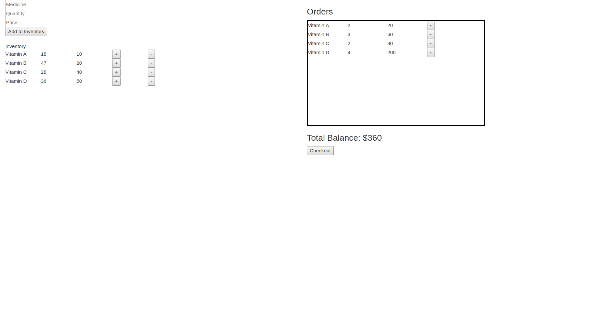

## Setup
[Install nodejs](https://nodejs.org)<br>
[Install create-react-app](https://github.com/facebookincubator/create-react-app)<br>
Generate your starting files
```
create-react-app my-app
```
After creation, your project should look like this:
```
my-app/
  README.md
  node_modules/
  package.json
  public/
    index.html
    favicon.ico
  src/
    App.css
    App.js
    App.test.js
    index.css
    index.js
    logo.svg
```
In the project directory, you can run:
```
 npm start
```
Open [http://localhost:3000](http://localhost:3000) to view it in the browser.

The page will reload if you make edits.<br>
You will also see any lint errors in the console.

#### Try editing some files
To get started, open app.js with your favorite editor <br>
We're building our own app so delete everything inside return()<br>

### Add Codes in app.js

Add the following codes to import component and css:

```
  import React, { Component } from 'react';
  import './App.css';

```

### Code Snippets: Product List
```
  class ProductList extends Component{
  constructor(props){
    super(props);
    this.state = {
      total:0, 
      productList: [
      {name: "Vitamin A", qty: 20, price: 10}, 
      {name: "Vitamin B", qty: 50, price: 20},
      {name: "Vitamin C", qty: 30, price: 40},
      {name: "Vitamin D", qty: 40, price: 50},
      ],
      orders: []
    };
    this.calcTotal =  this.calcTotal .bind(this);
    this.createProduct = this.createProduct.bind(this);
    this.calcQty = this.calcQty.bind(this);
  }

```

### Creating Component

Components let you split the UI into different pieces.
Create a new component Item


### View


